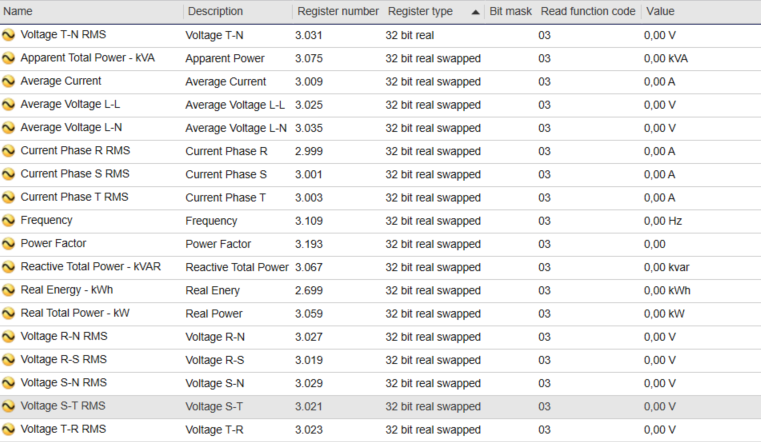
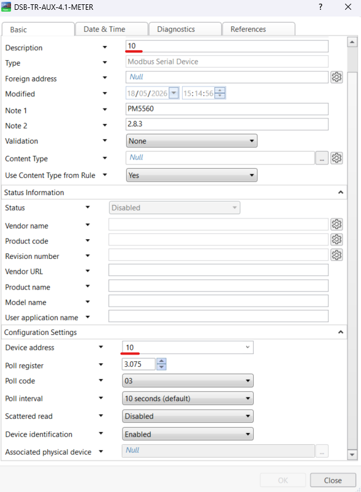
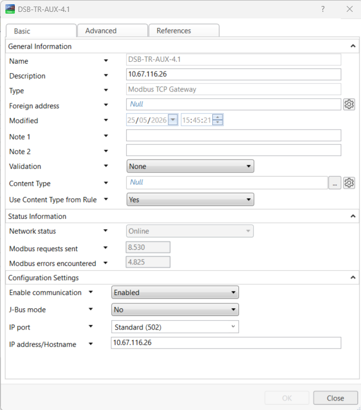
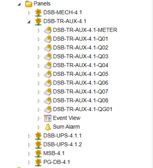
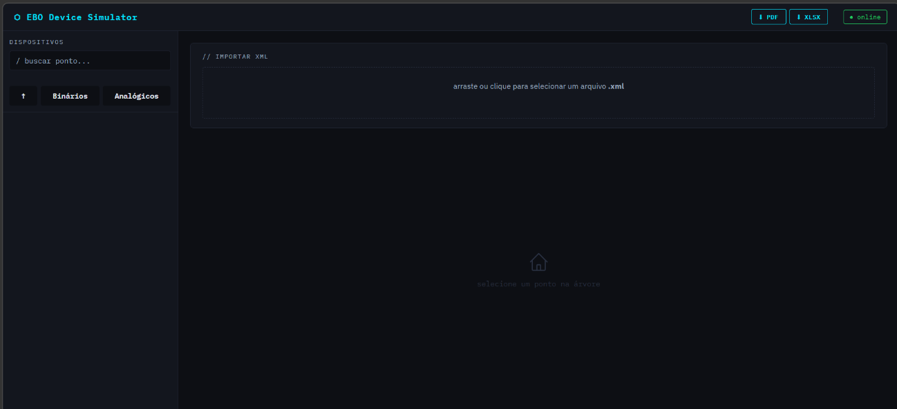
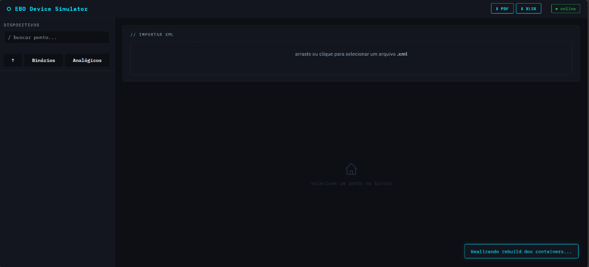
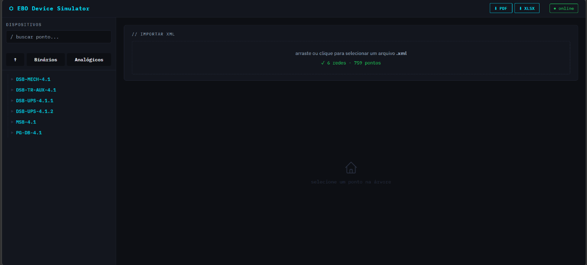
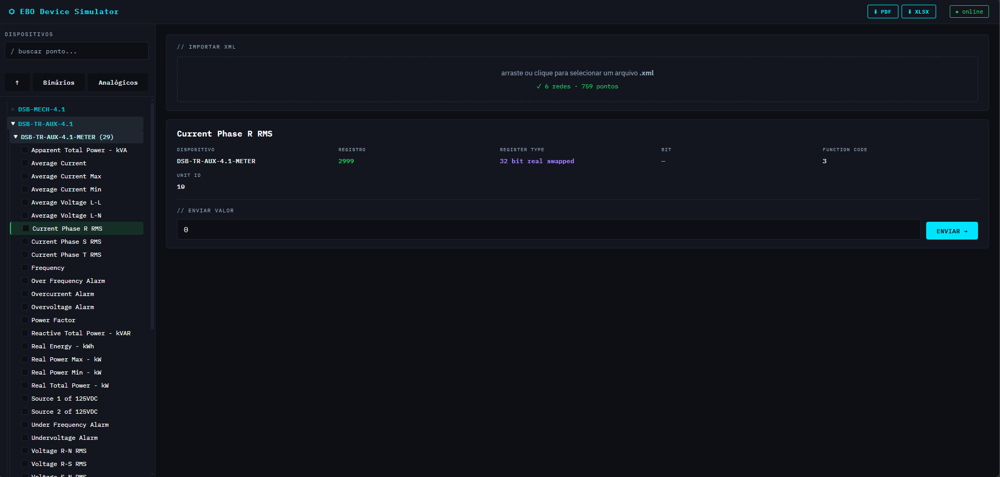
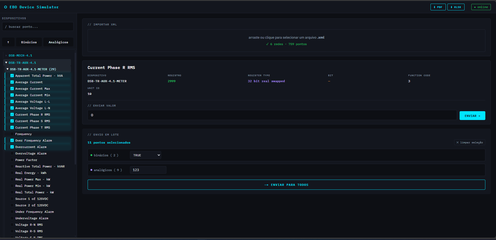

# EBO Device Simulator

Simulador de dispositivos e pontos para testes de comunicação e integração com ambientes Modbus.

O **EBO Device Simulator** foi desenvolvido para auditoria, validação e testes de telas gráficas e dispositivos Modbus integrados ao **EcoStruxure Building Operation (EBO)**. Ele importa a estrutura XML exportada do EBO e cria automaticamente dispositivos simulados em containers Docker, o que permite testar o supervisório sem depender de equipamentos físicos.

Com ele é possível visualizar a estrutura de redes e dispositivos, selecionar pontos analógicos e binários e enviar valores para os pontos escolhidos. Todas as operações feitas durante os testes ficam registradas e podem ser exportadas em relatórios PDF e XLSX para fins de auditoria.

---

## Sumário

- [Para que serve](#para-que-serve)
- [Funcionalidades](#funcionalidades)
- [Requisitos](#requisitos)
- [Preparação do EBO](#preparação-do-ebo)
- [Como utilizar](#como-utilizar)
- [Auditoria dos testes](#auditoria-dos-testes)
- [Glossário](#glossário)

---

## Para que serve

A ferramenta ajuda equipes de automação, integração e comissionamento durante testes e validações de sistemas supervisórios. Os principais usos são:

- Validação de telas gráficas.
- Testes de comunicação Modbus.
- Auditoria de pontos analógicos e binários.
- Verificação de alarmes.
- Testes de integração.
- Validação operacional sem dispositivos físicos.

O público-alvo são operadores, integradores e responsáveis pela validação do sistema.

---

## Funcionalidades

- Importação de arquivos XML por upload ou arrastar e soltar.
- Leitura e organização da estrutura de:
  - Networks;
  - Devices;
  - Pontos analógicos;
  - Pontos binários.
- Pesquisa de pontos.
- Expansão e recolhimento da árvore de dispositivos.
- Seleção individual ou múltipla de pontos.
- Seleção por `Ctrl + Clique`.
- Seleção por área utilizando `Shift`.
- Seleção rápida de pontos binários.
- Seleção rápida de pontos analógicos.
- Envio de valores analógicos.
- Envio de valores binários.
- Escrita por bit.
- Escrita em lote.
- Envio simultâneo para múltiplos Unit IDs.
- Registro das operações realizadas durante os testes.
- Geração de relatórios em PDF.
- Geração de relatórios em XLSX.
- Integração com containers Docker.

---

## Requisitos

Antes de iniciar o sistema, certifique-se de que os seguintes requisitos estejam disponíveis:

- Windows 10 ou superior
- Docker Desktop instalado
- PowerShell habilitado
- Placa de rede `Ethernet` ativa
- EcoStruxure Building Operation (EBO) configurado
- Arquivo XML exportado do EBO e compatível com o simulador

> O Docker Desktop deve permanecer aberto durante toda a utilização do sistema.

---

## Preparação do EBO

O simulador depende de como o projeto está configurado no EBO. Antes de exportar o XML, confira os itens abaixo, pois é a partir deles que o simulador identifica e mapeia os dispositivos na importação.

### Pontos Modbus

A base de dados Modbus do EBO precisa estar configurada previamente. Cada ponto deve ter, conforme o projeto:

- Número de registro;
- Tipo de registro;
- Função de leitura;
- Configuração de bit, quando aplicável.



### Dispositivos

Cada dispositivo Modbus deve ter o parâmetro **Device Address** configurado, e o endereço precisa ser único dentro do mesmo gateway ou cliente Modbus.

> **Importante:** o número configurado em **Device Address** deve estar presente também no campo **Description** do dispositivo dentro do EBO. O simulador usa essa informação para identificar e mapear corretamente cada dispositivo durante a importação.



### Client ou Gateway

O Client ou Gateway Modbus deve ter um **IP único** configurado corretamente e o parâmetro **J-Bus mode** definido como `No`.



### Estrutura no EBO

A título de referência, é assim que os painéis, gateways e dispositivos aparecem organizados na árvore do EBO antes da exportação.



---

## Como utilizar

### 1. Inicie o sistema

Abra o **EBO Device Simulator**. A tela inicial exibe a área de importação do XML, a barra lateral de dispositivos e, no canto superior direito, os botões de download dos relatórios e o indicador de status do sistema.



### 2. Inicie o Docker Desktop

Abra o **Docker Desktop** e aguarde até que o serviço esteja em execução.

### 3. Verifique a placa de rede

Certifique-se de que a placa de rede **Ethernet** esteja ativa.

### 4. Importe o arquivo XML

Na tela inicial, importe o arquivo XML exportado do EBO. Ele deve conter os devices, networks, telas gráficas e pontos necessários para os testes. Há duas formas de importar:

- Clique na área de upload (*arraste ou clique para selecionar um arquivo .xml*) e selecione o arquivo.
- Arraste o arquivo XML diretamente para a área de upload.

### 5. Aguarde o rebuild

Após a importação, o sistema inicia automaticamente a criação dos simuladores Modbus. Durante esse processo, a mensagem **"Realizando rebuild dos containers..."** é exibida no canto inferior direito da tela, e os containers Docker responsáveis por simular os dispositivos do XML são criados.

Aguarde até que o processo seja concluído.

> O tempo de rebuild varia de acordo com a quantidade de pontos presentes no arquivo XML.



### 6. Visualize os dispositivos

Ao final do rebuild, a árvore de navegação é exibida no lado esquerdo da interface, com as networks, devices e pontos identificados no XML. Um resumo da importação (por exemplo, quantidade de redes e de pontos) aparece na área de importação.

```text
Networks
└── Devices
    ├── Pontos analógicos
    └── Pontos binários
```



Na parte superior da barra lateral há um campo de pesquisa para localizar pontos rapidamente. Logo abaixo ficam os botões auxiliares:

| Botão | Ação |
| --- | --- |
| Seta para cima | Recolhe toda a árvore de navegação |
| Binários | Seleciona automaticamente todos os pontos binários |
| Analógicos | Seleciona automaticamente todos os pontos analógicos |

### 7. Selecione um ponto e envie um valor

Clique em um elemento da árvore para expandir seus itens filhos. Para selecionar um ponto individualmente, clique sobre o nome dele. As informações do ponto e o campo para envio de valores aparecem na área central da tela:

- **Dispositivo** ao qual o ponto pertence;
- **Registro**;
- **Register type**;
- **Bit**, quando aplicável;
- **Function code**;
- **Unit ID**.

Digite o valor desejado no campo **Enviar valor** e clique em **Enviar**.



### 8. Envie valores em lote

Para trabalhar com vários pontos ao mesmo tempo, marque as checkboxes na árvore. Também é possível usar `Ctrl + Clique` para seleção individual múltipla ou `Shift + Clique` para seleção por área.

Quando há mais de um ponto selecionado, surge o painel **Envio em lote**, que mostra a quantidade de pontos selecionados e permite definir um valor para os binários (`TRUE` ou `FALSE`) e outro para os analógicos. O botão **Enviar para todos** aplica os valores de uma só vez. Para desfazer a seleção, use **Limpar seleção**.



---

## Auditoria dos testes

Depois dos testes, é **necessário** baixar a auditoria do envio de valores. No canto superior direito da tela ficam os botões **PDF** e **XLSX**, que geram o relatório com as informações necessárias para auditar o teste.

> Baixe o arquivo assim que finalizar os testes.

---

## Glossário

| Sigla / Termo | Significado | Descrição |
| --- | --- | --- |
| **BMS** | *Building Management System* | Sistema de Gestão Predial que integra e controla subsistemas como HVAC, iluminação e energia. |
| **EBO** | *EcoStruxure Building Operation* | Software da Schneider Electric usado para operação e monitoramento do sistema. |
| **Unit ID** | Identificador do dispositivo Modbus | Corresponde ao Device Address configurado no EBO. |
